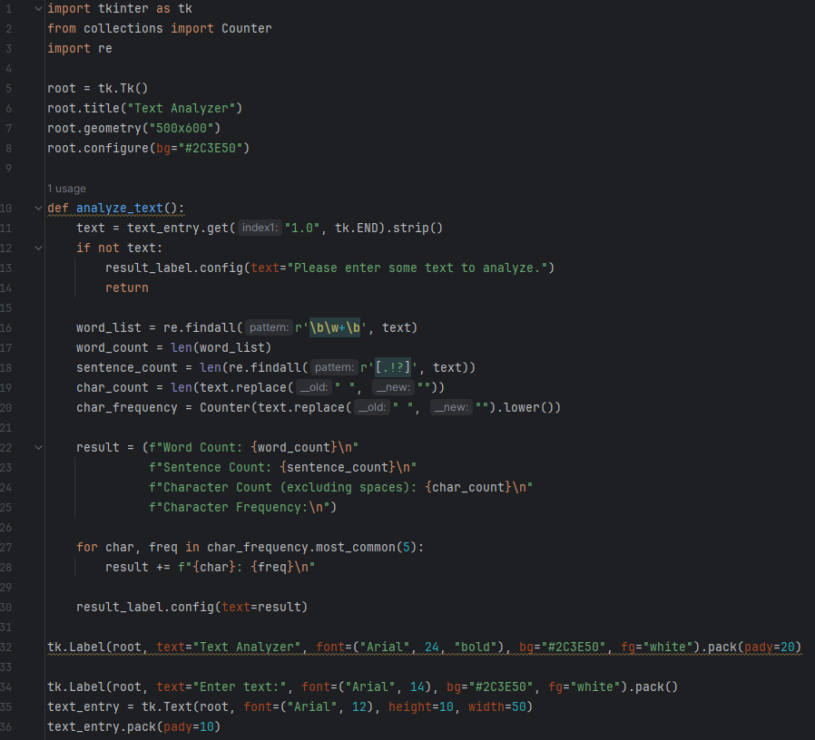
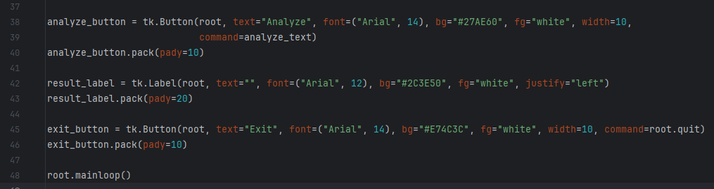
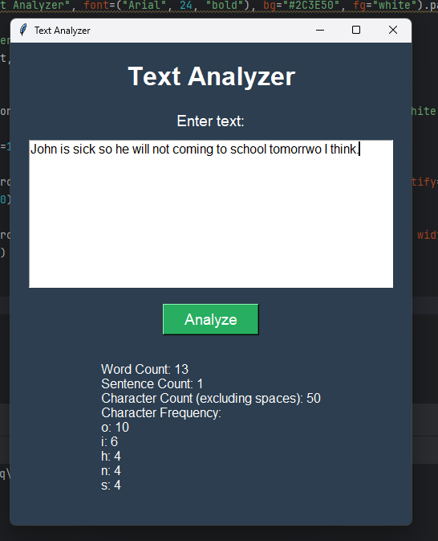

# 📝 Text Analyzer — Python Desktop GUI Text Analysis Tool

> A lightweight, dark-themed desktop text analysis tool built with Python and Tkinter that instantly computes word count, sentence count, character count, and top character frequency from any pasted text.

🎬 **Watch the Demo Video — Text Analyzer:** [Google Drive Demo Video](https://drive.google.com/file/d/1XZUwtNyi8wJ3xsLPkEIv1GgEW_IkpqU5/view?usp=drive_link)

[](https://www.python.org/)
[](https://docs.python.org/3/library/tkinter.html)
[](LICENSE)

---

## 🌟 Overview

The **Text Analyzer** is a practical, Tkinter-based graphical desktop application developed as part of Python learning curriculum. The app accepts any block of text typed or pasted into a multi-line input field and, upon clicking **Analyze**, instantly computes four statistics:

- **Word Count** — total words found using regex token extraction
- **Sentence Count** — total sentences detected by `.` `!` `?` punctuation matching
- **Character Count** — total non-space characters
- **Top 5 Character Frequency** — the five most common characters (case-insensitive, spaces excluded)

This project reinforces essential Python string manipulation, regex patterns, and the `collections.Counter` class — all core topics from the BiStartX Month 01 curriculum.

---

## 📸 Screenshots

### Main Application Window
<p align="center">
  
</p>

### Analysis Results
<p align="center">
  
</p>

### Empty Input Validation
<p align="center">
  
</p>

---

## ✨ Features

- **🔢 Word Count**: Uses `re.findall(r'\b\w+\b', text)` — a regex boundary-based word tokenizer — to accurately count all words, including those separated by punctuation or special characters.
- **📖 Sentence Count**: Counts sentence-ending punctuation marks (`.` `!` `?`) using `re.findall(r'[.!?]', text)` to calculate the approximate number of sentences.
- **🔡 Character Count (Excluding Spaces)**: Counts all characters after stripping whitespace via `text.replace(" ", "")` for a clean character count.
- **📊 Top 5 Character Frequency**: Uses Python's `collections.Counter` to build a full frequency map of all non-space characters (lowercased), then returns the 5 most common characters with their counts.
- **⚠️ Empty Input Validation**: If the input field is empty, a descriptive inline message is shown directly in the result label — no dialogs needed.
- **🖤 Dark-Themed UI**: Consistent slate-blue dark theme (`#2C3E50`) matching the suite:
  - 🟢 **Analyze** button — Green (`#27AE60`)
  - 🔴 **Exit** button — Red (`#E74C3C`)
- **📋 Multi-Line Input**: A `tk.Text` widget (10 lines tall, 50 characters wide) allows pasting long paragraphs of text for comprehensive analysis.

---

## 🛠️ Tech Stack

| Component | Technology |
| :--- | :--- |
| **Language** | Python 3.8+ |
| **GUI Framework** | `tkinter` (Python Standard Library) |
| **Text Processing** | `re` (Regular Expressions) |
| **Frequency Analysis** | `collections.Counter` |
| **IDE** | PyCharm |

---

## 📁 Project Structure

```
Text-Analyzer/
│
├── TextAnalyzer.py        # Main application — GUI layout and analysis engine
├── 3333.docx              # Project documentation with screenshots & activity log
├── screenshots/
│   ├── screenshot_1.png   # Main window (empty state)
│   ├── screenshot_2.png   # Analysis output with word/sentence/char counts
│   ├── screenshot_3.png   # Character frequency results
│   └── screenshot_4.png   # Empty input validation message
└── README.md
```

---

## ⚙️ How It Works

```
User pastes or types text into the multi-line Text widget
                     ↓
User clicks [Analyze]
                     ↓
analyze_text() runs:
  ┌──────────────────────────────────────────────┐
  │ text empty?                                  │
  │   → result_label shows warning message       │
  │                                              │
  │ text has content?                            │
  │   → word_list  = re.findall(r'\b\w+\b', text)│
  │   → word_count = len(word_list)              │
  │                                              │
  │   → sentence_count = len(re.findall(        │
  │       r'[.!?]', text))                       │
  │                                              │
  │   → char_count = len(text.replace(" ", "")) │
  │                                              │
  │   → char_frequency = Counter(               │
  │       text.replace(" ","").lower())          │
  │   → top 5 chars extracted via .most_common()│
  │                                              │
  │   → result_label updated with full report   │
  └──────────────────────────────────────────────┘
                     ↓
User clicks [Exit] → root.quit()
```

---

## 🚀 Getting Started

### Prerequisites
- **Python 3.8** or higher (`tkinter`, `re`, and `collections` are all part of Python's standard library — no pip installs needed)

### Run the App

**1. Clone the Repository:**
```bash
git clone https://github.com/AnasQ2003/Text-Analyzer.git
cd Text-Analyzer
```

**2. Launch the Application:**
```bash
python TextAnalyzer.py
```

The window opens immediately. Paste or type any text, then click **Analyze**!

---

## 💡 Key Concepts Demonstrated

| Concept | How It's Used |
| :--- | :--- |
| **Regular Expressions** | `re.findall()` for word and sentence pattern matching |
| **`collections.Counter`** | Builds frequency map of characters and returns top-5 via `.most_common(5)` |
| **String Methods** | `.strip()`, `.replace()`, `.lower()` for text normalization |
| **`tk.Text` Widget** | Multi-line text input read via `.get("1.0", tk.END)` |
| **f-Strings** | Dynamic result string formatting with computed stats |
| **Label Updates** | `result_label.config(text=result)` for live result rendering |
| **Empty Guard Clause** | Early return pattern when input is blank |
| **Loop + String Concat** | `for char, freq in char_frequency.most_common(5)` builds the output |

---

## 🧠 Learning Objectives 

> ✅ **Objective**: Understand how Python handles strings, text parsing, and frequency analysis using built-in modules and the standard library.

**Activities Completed:**
- ✔️ Learned Python string methods: `.strip()`, `.replace()`, `.lower()`, `.split()`.
- ✔️ Explored regular expressions (`re` module) for pattern-based text extraction.
- ✔️ Used `collections.Counter` to build frequency analysis from text data.
- ✔️ Practiced reading from multi-line `tk.Text` widgets in Tkinter GUIs.
- ✔️ Built a real-world NLP-flavored tool with practical text statistics output.

**Key Takeaways:**
- Regular expressions are powerful for flexible, pattern-based text parsing.
- `collections.Counter` is the Pythonic way to count and rank frequencies.
- Real-world text analysis always starts with normalization (strip, lowercase, remove spaces).
- GUI apps can display complex multi-line analysis results using simple `Label.config()` updates.

---

## 📄 License

```
MIT License

Copyright (c) Text Analyzer --- 2026 AnasQ2003

Permission is hereby granted, free of charge, to any person obtaining a copy
of this software and associated documentation files (the "Software"), to deal
in the Software without restriction, including without limitation the rights
to use, copy, modify, merge, publish, distribute, sublicense, and/or sell
copies of the Software, and to permit persons to whom the Software is
furnished to do so, subject to the following conditions:

The above copyright notice and this permission notice shall be included in all
copies or substantial portions of the Software.

THE SOFTWARE IS PROVIDED "AS IS", WITHOUT WARRANTY OF ANY KIND, EXPRESS OR
IMPLIED, INCLUDING BUT NOT LIMITED TO THE WARRANTIES OF MERCHANTABILITY,
FITNESS FOR A PARTICULAR PURPOSE AND NONINFRINGEMENT.
```

---

## 👨‍💻 Author

**Anas Ahmed Qureshi.** — [@AnasQ2003](https://github.com/AnasQ2003)

---

<div align="center">
  <p>Built with ❤️ by <strong>Anas</strong></p>
  
 <div align="center">

Made with 💧 and a lot of ☕

**⭐ If you found this useful, please star the repository!**

</div>
